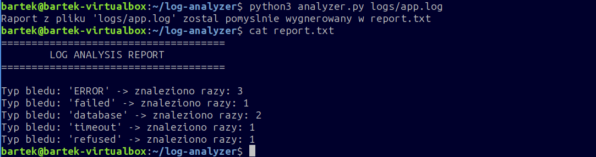

# Linux Log Monitoring Tool
Prosty skrypt w Pythonie, który automatycznie przeszukuje pliki z logami aplikacji w poszukiwaniu błędów i robi z nich szybkie podsumowanie.

## Co robi ten projekt?
1. Program otwiera wskazany przez nas plik tekestowy z logami.
2. Szuka w nim słów kluczowych takich jak: `ERROR`, `timeout`, `failed`, `refused`, `database`.
3. Zlicza, ile razy dany błąd się pojawił.
4. Zapisuje gotowy wynik do pliku `report.txt`.

## Struktura plików
* `analyzer.py` - skrypt uruchamiający analizę.
* `logs/app.log` - przykładowy plik z logami, na którym testoswałem program.
* `report.txt` - wygnerowany plik z gotowym raportem.

## Jak go uruchomić?
Skrypt nie ma wpisanej nazwy pliku na stałe. Ścieżkę do logów podajesz bezpośrednio w terminalu jako argument:

```bash
python3 analyzer.py logs/app.log
```
## Podgląd działania programu

Oto wynik uruchomienia skryptu oraz zawartość wygenerowanego raportu w terminalu:



